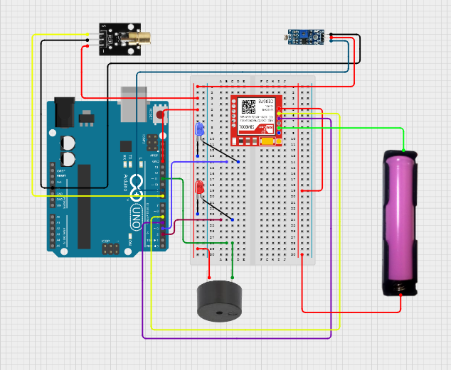
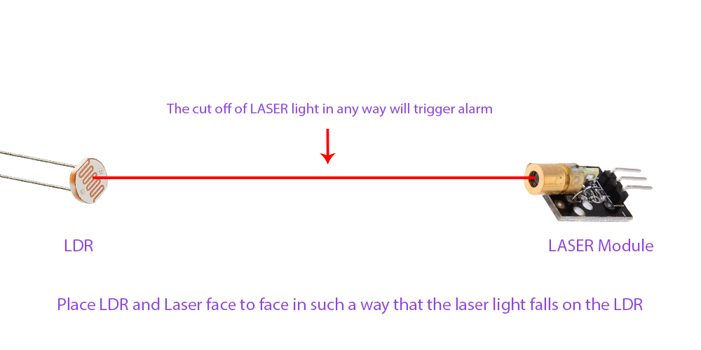
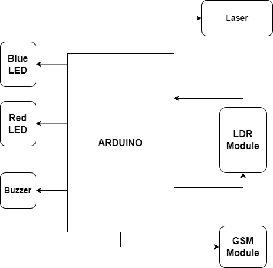

<h1 align="center">🏠 Home Security System using Arduino Microcontroller 🚨</h1>

  A smart, Arduino-based home security system that provides remote monitoring and alerts for your residence. 🛡️📱

  
  
  
  

---

## 📖 Overview

This **Home Security System** allows homeowners to monitor and control the security of their property, whether inside the residence or remotely. Utilizing an **Arduino UNO microcontroller**, the system integrates various sensors and modules to detect intrusions and send alerts to the homeowner's phone.

By employing a **SIM800L Mini GPRS/GSM module**, the system alerts at  real-time by phone calls, allowing homeowner to know about any intrusion.

---

## 💡 Features
- **Intrusion Detection**: Detect unauthorized entry using an **LDR sensor** and **laser diode module**.
- **Real-time Alerts**: Receive instant phone call when a breach is detected.
- **Battery-Powered**: Runs independently using an **18650 battery** for portability and ease of use.

---

## 🛠️ Technologies Used

- **Arduino UNO**: The core microcontroller that controls the system's functionality.
- **SIM800L Mini GPRS/GSM Module**: For SMS communication and remote control via phone calls.
- **LDR Sensor Module**: Detects changes in light intensity, used to identify intrusion.
- **Laser Diode Module**: Creates a secure laser perimeter, detecting any disruption caused by an intruder.
- **1207 Passive Buzzer**: Activates an alarm sound upon intrusion detection.
- **18650 Battery and Holder**: Powers the system, ensuring it works independently of mains electricity.

---

## 📊 Example Output

Once the system is activated, an intrusion would trigger the following actions:

1. **Buzzer Alarm**: An immediate sound to alert anyone nearby.
2. **Phone Call Alert**: The system sends an call to the homeowner’s phone automatically.
---

## ⚡ Circuit Diagram

  
---

## 🛠️ Working Method

  

1. **Laser Detection**: The red laser diode is placed across the entry point. The LDR (Light Dependent Resistor) detects any interruption in the laser beam, signaling a potential intrusion.
2. **Buzzer Activation**: Upon detecting a laser beam interruption, the Arduino activates the 1207 buzzer to produce an alert sound, notifying the homeowner of a potential security breach.
3. **Remote Alert**: Simultaneously, the SIM800L module sends a phone call to the homeowner's mobile phone, informing them of the detected movement or unauthorized access.
4. **Power Supply**: The system is powered by an **18650 battery**, ensuring that the security system remains operational even during power outages.
---

## 📊 Block Diagram

  

---

<!--
## 🎥 Project Demo Video

Watch the demo video to see how the **Home Security System** operates in real-time:

  

---
-->

## 👥 Project Contributors
- **Tanjim Rahman** - [mdtanjimrahman](https://github.com/mdtanjimrahman)  
- **Basharul - Alam - Mazu** - [basharulalammazu](https://github.com/basharulalammazu)  

---
